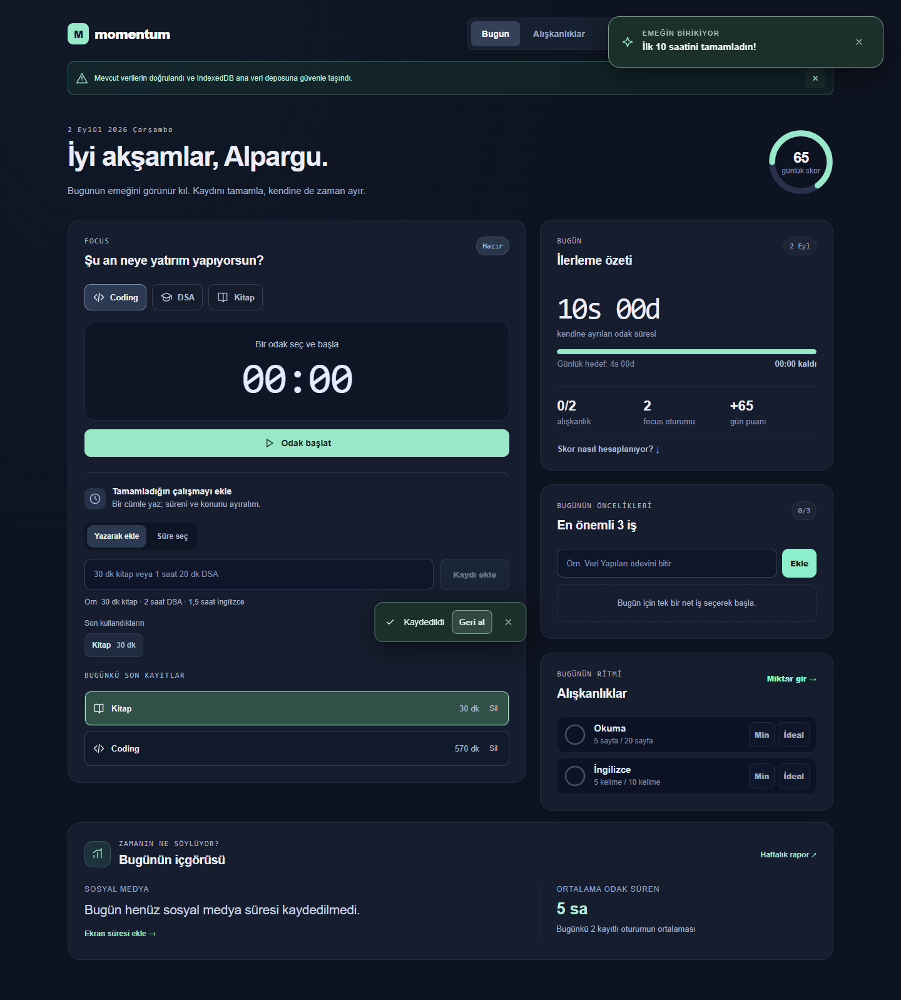

# Momentum

Momentum; odak oturumlarını, alışkanlıkları, günlük öncelikleri, ekran süresini ve uzun vadeli hedefleri tek yerde takip eden local-first bir React PWA'dır.

> Durum: v1.0 altyapısı hazır. Uygulama bugün cihaz üzerinde çalışır; hesap, güvenli bulut senkronizasyonu ve sunucu taraflı AI özellikleri Supabase projesi bağlandığında açılır.



## Öne çıkanlar

- Duraklatılabilir tam ekran odak zamanlayıcısı
- Minimum/ideal hedefli alışkanlık takibi ve seriler
- Günlük plan, değerlendirme, hedef ve takvim blokları
- Ekran süresi kaydı ve Gemini ile ekran görüntüsü analizi
- Günlük, haftalık ve aylık üretkenlik raporları
- IndexedDB ana deposu, otomatik kurtarma sürümleri ve doğrulanan JSON yedekleri
- PWA kurulumu ve çevrimdışı uygulama kabuğu

## Mimari

```text
React PWA ──önce──> IndexedDB
    │
    ├── isteğe bağlı oturum ──> Supabase Auth
    ├── revizyon kontrollü yedek ──> PostgreSQL + RLS
    └── ekran görüntüsü ──> kimlik doğrulanan Edge Function ──> Gemini
```

Uygulama hesap olmadan çalışır. Hesap bağlandığında yerel kayıt ve bulut kaydı otomatik olarak birleştirilmez; kullanıcı ilk seferde hangisinin esas alınacağını seçer. Sonraki yazımlar revizyon kontrolüyle yapılır, böylece başka cihazdaki daha yeni veri sessizce ezilmez.

## Teknoloji

- React 19, TypeScript ve Vite
- IndexedDB tabanlı local-first veri katmanı
- Supabase Auth, PostgreSQL ve Row Level Security (v1.0)
- Supabase Edge Functions üzerinden Gemini API (v1.0)
- Node test runner ve GitHub Actions (v1.0)

## Yerel geliştirme

Gereksinim: Node.js 22.12 veya daha yeni bir sürüm.

```bash
npm ci
npm run dev
```

Üretim doğrulaması:

```bash
npm run check
```

## Ortam değişkenleri

`.env.example` dosyasını `.env.local` adıyla kopyalayın ve Supabase projenizin browser için güvenli değerlerini girin. Secret veya service-role anahtarlarını `VITE_` ile başlayan değişkenlere koymayın; bu değişkenler tarayıcı paketine dahil edilir.

Bulut değerleri tanımlı değilse Momentum hesap özelliğini kapalı tutarak yerel çalışmaya devam eder.

Supabase veritabanı, Auth ve Edge Function kurulumu için [Supabase kurulum notlarına](supabase/README.md) bakın.

## Production deploy

1. Ücretsiz Supabase projesini oluşturup migration'ları ve Edge Function'ı deploy edin.
2. Projeyi GitHub'a gönderin ve Vercel'e bağlayın.
3. Vercel Environment Variables alanına `VITE_SUPABASE_URL` ile `VITE_SUPABASE_PUBLISHABLE_KEY` değerlerini ekleyin.
4. Vercel adresini Supabase Authentication URL Configuration alanındaki Site URL ve Redirect URLs listesine ekleyin.
5. Canlı uygulamada yeni bir deneme hesabıyla giriş, iki yönlü senkronizasyon ve AI analizini doğrulayın.

Vercel güvenlik başlıkları [vercel.json](vercel.json), her push/PR doğrulaması ise [.github/workflows/ci.yml](.github/workflows/ci.yml) içinde tanımlıdır.

## Veri güvenliği

- Kullanıcı verisi varsayılan olarak cihazdaki IndexedDB'de tutulur.
- Bulut senkronizasyonu isteğe bağlıdır.
- Bulut kayıtları kullanıcı kimliğiyle ayrılır ve PostgreSQL RLS politikalarıyla korunur.
- Gemini anahtarı istemciye gönderilmez; AI çağrıları kimlik doğrulanan server-side function üzerinden yapılır.
- Ekran görüntüleri analiz amacı dışında kalıcı olarak saklanmaz.

## Yol haritası

- [x] Güvenilir yerel kayıt, kurtarma ve yedekleme
- [x] Üretkenlik panelleri ve Gemini destekli ekran süresi ayrıştırma
- [x] İsteğe bağlı hesap oluşturma ve giriş
- [x] Çakışma korumalı cihazlar arası bulut senkronizasyonu
- [x] Gemini çağrısını kimlik doğrulanan Edge Function'a taşıma
- [x] Test, tip kontrolü ve build için GitHub Actions
- [ ] Supabase ve Vercel production ortamlarını oluşturup canlıya alma
